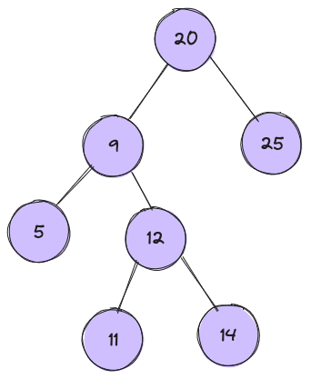

# Algoritmos
* Bibliografia: BARGHAVA, Aditya. Grokking Algorithms. Edição digital.

## Binary search

  Algoritmos de busca binária consistem em uma série de instruções para pesquisa de um item em um conjunto de itens a partir da divisão do conjunto de itens em subconjuntos.
  O objetivo é dividir o conjunto de itens pela metade e descartar metade desses itens até achar o item pesquisado ou descartar todos os dados e concluir que o item não faz parte do conjunto.

  Só é possível fazer uma busca binária em uma lista ordenada.

  Por exemplo, ao pesquisar uma palavra em um dicionário. O primeiro passo seria abrir o dicionário ao meio e verificar se a palavra se encontra naquela página.
  Caso contrário, verificar se a palavra pesquisada se encontra na metada anterior ou posterior do dicionário.
  Assim, descartamos metade do dicionário e continuamos a pesquisa com a metade restante.
  Considerando apenas essa metade restante, devemos abrir de novo ao meio e verificar se a palavra se encontra ali.
  Caso contrário, procederemos conforme os passos anteriores, sempre descartando metade dos itens, até achar a palavra pesquisada.

  Exemplo de algoritmo em Python:

  ```
    # low and high keep track of which part of the list you'll search in.
    low = 0
    high = len(list) - 1

    # While you haven't narrowed it down to one element
    while low <= high:
      # check the middle element
      mid = (low + high) // 2
      guess = list[mid]
      # Found the item.
      if guess == item:
        return mid
      # The guess was too high.
      if guess > item:
        high = mid - 1
      # The guess was too low.
      else:
        low = mid + 1

    # Item doesn't exist
    return None
```
### Binary Search Tree

Uma árvore de busca binária (BST) é uma árvore em que todos os nós seguem as seguintes propriedades:

  * A raiz tem o maior valor na subárvore esquerda;
  * A raiz tem o menor valor na subárvore direita;
  * Cada subárvore esquerda é formada por nós com valores menores que a raiz;
  * Cada subárvore direita é formada por nós com valores maiores que a raiz.



Vamos encontrar a maior chave na árvore que é menor que um determinado número `n`.

Primeiro, vamos pensar na BST. A maior chave na árvore que é menor que `n` é o nó mais à direita na subárvore esquerda de `n`.

```python
func FindLargestSmallerKey(rootNode *Node, num int) int {
  largestSmaller := -1

  node := rootNode

  for node != nil {
      if node.key < num {
          largestSmaller = node.key
          node = node.right
      } else {
          node = node.left
      }
  }

  return largestSmaller
}
```

* Toda vez que vemos que a chave é menor que nosso n, começamos a encontrar nosso maior menor na subárvore direita;
* Toda vez que vemos que a chave é maior que nosso n, começamos a encontrar nosso maior menor na subárvore esquerda;
* Seguindo esse raciocínio, encontraremos a maior chave menor no nó mais à direita da subárvore esquerda sem compará-la com nenhuma chave anterior.

  ### Big O notation

  Big O notation refere-se ao número de operações que um determinado algoritmo terá que fazer no pior cenário possível até solucionar o problema.
  No caso da busca binária, O(log n).
  Isso significa que em um conjunto de tamanho (n), o número de operações necessárias no pior caso possível para encontrar a solução é de log n.
  Quanto maior a base de dados, então, melhor a performance da busca binária em relaçãoo à busca simples.
  A busca simples tem um Big O(n), o que significa que o número de operações, no pior cenário, equivale ao tamanho da base de dados (n).
  * Busca binária tem um Big O(log n)

## Arrays and Lists

Arrays e Listas são formas de armazenar dados na memória.
Na array, os dados são armazenados de forma contígua. A vantagem é que isso permite que os dados sejam acessados de forma aletória, ou seja, permite uma leitura rápida dos dados. A desvantagem é que a inserção e deleção de dados na array é mais lenta que nas listas, porque em último caso é preciso mover a array inteira para outro lugar na memória. Como na array os dados são armazenados de forma contígua, ao inserir um novo dado, se não houver espaço na memória no endereço contíguo imediato ao fim da array, toda ela deverá ser movida para um novo endereço.

Já nas listas (linked lists), os dados não são armazenados de forma contígua, mas sim de acordo com o espaço livre de memória, e isso é feito ao armazenar junto com o dado o endereço do próximo item da lista. Isso permite que as inserções e deleções sejam rápidas, Big O(1), já que é só inserir o novo dado ao final da lista ou fazer com que um item aponte para outro endereço de memória para deletar itens. Mas a desvantagem é que a velocidade de leitura é menor do que nas arrays, porque as listas não permitem acesso aleatório. Assim, a velocidade de leitura tem Big O(n).

  ```
    Velocidades de execução:
              Arrays    Listas
    Leitura    O(1)      O(n)
    Inserção   O(n)      O(1)
    Deleção    O(n)      O(1)
```

A partir de arrays e linked lists, é possível construir estruturas de dados mais complexas que permitem manipular um grande volume de dados com maior otimização em leitura, inserção e deleção.

Por exemplo, é possível utilizar um modelo híbrido de array e listas, em que em uma array de 26 elementos (A-Z), cada elemento aponta para uma linked list. Dessa forma, a inserção e deleção terá a mesma velocidade das listas, O(1), mas a leitura será mais rápida do que em uma linked list convencional.

## Selection sort

* Para aplicar uma busca binária em uma estrutura de dados, esta precisa estar ordenada. A selection sort é uma das formas de ordenação de dados.
* Na selection sort, o conjunto de dados é varrido de forma a achar o valor mais baixo (ou mais alto) e adicioná-lo a outro conjunto de dados, ou colocá-lo no início do conjunto. Feito continuamente até o final do conjunto, ao final ele estará ordenado.
* Big 0(n^2): a cada varrição, checa-se n, depois n-1, n-2, n-3... elementos. Ou seja n + (n-1) + (n-2)...+1 = n * (1/2 * n).
  Como constantes são ignoradas no cálculo do Big O: n^2.

  Exemplo de algoritmo em Python

```
      * Para encontrar o menor valor em uma array:
        def findSmallest(arr):
            # Stores the smallest value
            smallest = arr[0]
            # Stores the index of the smallest value
            smallest_index = 0
            for i in range(1, len(arr)):
                if arr[i] < smallest:
                smallest_index = i
                smallest = arr[i]
            return smallest_index


  * Para ordenar a array:
         def selectionSort(arr):
            newArr = []
            for i in range(len(arr)):
                # Finds the smallest element in the array and adds it to the new array
                smallest = findSmallest(arr)
                newArr.append(arr.pop(smallest))
            return newArr
```

## Recursion

* Recursão é um mecanismo de programação em que uma função chama a si mesma.
* Para que a função não seja executada infinitamente, usa-se um base case.
* Base case: define quando a função deverá retornar
* Recursive case: define os termos em que a função deverá chamar a si mesma.
* Embora seja uma solução mais clara e elegante, ela não necessariamente trará ganhos de desempenho.
* Como todas as chamadas da função ficarão na pilha de chamadas até que se chegue ao base case, usar recursão consome bastante a memória.

### Call Stack

* As funções, quando chamadas, vão para a call stack (pilha de chamadas).
* Quando uma função é chamada dentro de outra função, ela fica "empilhada" em cima da função anterior.
* Conforme as funções retornam, elas são retiradas da call stack.
* Muitas funções em processamento podem ocupar muita memória.

### Algoritmo de binary search com recursão

```
  def search(x, list):
  mid = (len(list) - 1)// 2
  if x == list[mid]:
      return x
  elif x > list[mid]:
      return search(x, list[mid+1 :])
  else:
      return search(x, list[: mid-1])
```
## Quicksort
* É um algoritmo de ordenação de elementos em um conjunto.
* Como funciona:
  1. Escolhe-se um elemento do conjunto (pode ser qualquer um) e compara-se esse elemento com os outros itens do conjunto
  2. Se o item for menor ou igual o elemento escolhido, ele é colocado em um outra lista à esquerda.
  3. Se o item for maior, ele é colocado em outra lista à direita.
  4. Retorna-se a lista à esquerda + o elemento escolhido (pivot) + a lista à direita
  5. Repete-se o processo, até que as listas tenham 1 ou nenhum elemento (base case - neste ponto, a lista está ordenada).

```
def quicksort(list):
    list_left = []
    list_right = []
    list_pivot = []
    if len(list) < 2:
        return list
    else:
        pivot = list[0]
        for i in list[1:]:
            if i <= pivot:
                list_left.append(i)
            else:
                list_right.append(i)
        list_pivot.append(pivot)
    
    return quicksort(list_left) + list_pivot + quicksort(list_right)
```
### Big O Notation
* Quicksort é um caso à parte, porque o Big O depende de qual elemento for escolhido (pivot).
* Se o pivot for sempre escolhido de forma aleatória, estaremos diante do melhor cenário (que também é considerado o cenário mais comum), e nesse caso: O(n log n)
* No pior cenário quicksort tem um O(n^2), mas seria o cenário mais raro.

### Comparação entre Quicksort e Merge Sort
* Merge sort tem um O(n log n).
* Ou seja, merge é mais rápida que a quicksort no pior cenário o(n^2).
* No entanto, quicksort em geral tem um desempenho do melhor cenário e nesse caso O(n log n), exatamente como a merge sort.
* Só que a constante da quicksort é menor do que a constante da merge.
* Em geral, se desconsidera o valor das constantes no cálculo do Big O, mas nesse caso, como ambas têm o mesmo Big O, a constante fará diferença.
* Como a constante da quicksort é menor, ela terá um desempenho mais rápido que a merge sort.
* Quicksort seria um dos algoritmos mais rápidos existentes, se considerarmos que na média, seu desempenho é como no melhor cenário.

## Hash Tables
* Hash Table é a combinação de uma hash function com uma array.
* Hash function transforma uma string (ou qualquer outro tipo de dado) em um número.
* Principais requerimentos para uma boa hash function:
  1. Consistência: a mesma string precisa sempre mapear para o mesmo número.
  2. Diferentes strings devem mapear para diferentes números. De nada adianta a hash function retornar sempre o mesmo número.
* Esse número pode, então, ser usado para indicar em qual index de uma array um valor correspondente à string deve ser armazenado, formando uma hash table (mapeia chaves e valores).
* Python tem uma implementação de hash tables: dicionários
* Casos de uso: cache, DNS resolution

### Big O Notation

```
          Melhor cenário    Pior cenário
Pesquisa    O(1)                O(n)
Inserção    O(1)                O(n)
Deleção     O(1)                O(n)
```
* Melhor cenário ocorre quando:
  1. O fator de carregamento (load factor) é baixo, ou seja a relação entre o número de registros na tabela e o número de slots disponíveis é baixa. Um load factor > 0.7 = é melhor aumentar o número de slots disponíveis na tabela.
  2. Hash function não provoca muitas colisões na tabela (ao devolver o mesmo número para várias strings diferentes, por ex).
* No melhor cenário, hash tables performam melhor do que a busca simples(O(n)) e a busca binária(O(log n))

## Breadth-first Search
* É um algoritmo que permite fazer buscas em grafos.
* Grafos modelam um conjunto de conexões. Ele é composto de vértices (nodes) e arestas (edges). Um vértice pode estar ligado a diversos outros vértices diretamente.
* Os grafos também devem estar ordenados em queues (filas).
* Queues são FIFO (First In First Out), ou seja, o elemento que entrou primeiro, sai primeiro.
* Stacks são LIFO (Last In First Out), ou seja, o elemento que entrou por último é o primeiro a sair.
* Breadth-first search responde às perguntas "Existe um caminho para X?" e "Qual é o caminho mais curto para X?"
* Para aplicá-lo é preciso primeiro implementar um grafo. Em Python pode-se implementar um grafo com dicionários, que mapeia o relacionamento entre os vértices (nodes).
* O grafo deve ser ordenado em uma fila, para então a busca poder ser realizada.
* Os vértices serão analisados de acordo com sua ordem na fila (todos os vértices de primeiro grau primeiro, depois os de segundo grau, etc).
* Se um vértice é descartado, todos os vértices que se relacionam com este são adicionados à fila.
* No entanto, é preciso controlar se um vértice já foi pesquisado, para que a busca não entre em um loop infinito. Por isso, vértices já pesquisados não devem ser pesquisados novamente.
* Undirected graph vs Directed graph:
  1. Directed graphs: têm setas, e o relacionamento segue a direção da seta (A deve dinheiro a B).
  2. Undirected graphs: não têm setas, e o relacionamento funciona em ambos os sentidos.

### Big O Notation
* O(V + E) = número de vértices (V) + número de arestas, ou edges (E).

### Algoritmo
```
# Search if a person is a mango seller
from collections import deque

def person_is_seller(name):
      return name[-1] == 'm'

graph = {}
graph["you"] = ["alice", "bob", "claire"]
graph["bob"] = ["anuj", "peggy"]
graph["alice"] = ["peggy"]
graph["claire"] = ["thom", "jonny"]
graph["anuj"] = []
graph["peggy"] = []
graph["thom"] = []
graph["jonny"] = []

def search(name):
    search_queue = deque()
    search_queue += [name]
    # This is how you keep track of which people you've searched before.
    searched = set()
    while search_queue:
        person = search_queue.popleft()
        # Only search this person if you haven't already searched them.
        if person in searched:
            continue
        if person_is_seller(person):
            print(person + " is a mango seller!")
            return True
        search_queue += graph[person]
        # Marks this person as searched
        searched.add(person)
    return False

search("you")
```

## Algoritmo de Dijkstra
* Algoritmo usado para calcular o "caminho" mais rápido quando as arestas têm peso.
* Na breadth-first search o cálculo é feito sobre arestas sem peso, e o caminho mais curto é considerado o que envolve menos nós.
* No caso do algortimo de Dijkstra o peso dos nós é levado em conta.
* Isso é importante para calcular, por ex, o caminho mais rápido entre duas localidades, considerando as distâncias entre os nós e não apenas a quantidade de nós.
* Ele não funciona se as arestas tiverem peso negativo (use o algoritmo Bellman-Ford nesse caso).

## Greedy algorithms
* Algoritmo simples: a cada passo, escolha o caminho com melhor desempenho/ideal.
* Ex: escolher a maior quantidade de aulas que podem ser dadas em uma só classe. Ou a quantidade de caixas de diferentes tamanhos que cabem em um caminhão. Ou os itens de maior valor que cabem dentro de uma sacola.
* A cada passo, escolhe-se a opção mais localmente ideal, para que se termine com a opção mais globalmente ideal.
* Exemplo: como escolher em quais estações de rádio transmitir um programa, de forma a ter a maior cobertura com o menor número de estações?
  1. Escolha a estação que transmita para o maior número de localidades possível, que não tenham sido contempladas anteriormente.
  2. Repita o processo até que todas as localidades tenham sido esgotadas.

### Algoritmos de aproximação
* Quando um problema exige uma solução que leve muito tempo para ser calculada, pode-se recorrer a um algoritmo de aproximação.
* Ele não provém a solução completa para o problema, mas sim uma aproximação boa o suficiente. São também mais rápidos do que a solução completa.
* Algortimos de aproximação são julgados de acordo com:
  1. Rapidez com que a solução é alcançada.
  2. Quão próxima sua solução está da solução ideal.
* Greedy algorithms podem ser usados como algoritmos de aproximação.

### Problemas NP-completos
* São problemas que não têm uma solução que seja rápida.
* Ex: problema do caixeiro-viajante: como encontrar a rota mais rápida entre diferentes cidades? É um problema que só pode ser resolvido calculando todas as rotas individualmente para depois encontrar a mais rápida. E o número de rotas a serem calculadas é uma função fatorial: n! (sendo n o número de cidades a serem visitadas). Conforme o número de cidades cresce, o número de rotas a serem calculadas cresce fatorialmente. Por isso, a solução para esse problema, conforme o número de cidades cresce, pode demorar muito tempo ou se tornar inviável de ser calculada. Assim, usa-se um algoritmo de aproximação, como um greedy algorithm, para calcular a solução ideal mais aproximada.

## Programação dinâmica
* Usada quando é preciso optimizar uma solução dada alguma restrição.
* Exemplo: qual os itens que você deveria levar numa mochila, considerando que se quer levar os itens que somam o maior valor e que o tamanho da mochila é uma restrição.
* Para utilizar a programação dinâmica dividimos o problema em sub-problemas.
* Não é possível utilizá-la:
  1. Se os sub-problemas dependerem uns dos outros.
  2. Se você estiver considerando frações de um item.
* Para resolver o problema, deve-se usar uma tabela.
* Não existe uma única fórmula para calcular uma solução para programação dinâmica.

## K-vizinhos mais próximos
* É um algoritmo usado para classificação ou regressão de dados.

### Classificação de dados usando KNN (K-nearest neighbors)
* Como funciona:
  1. Para classificar um dado, escolhas alguma(s) características deste e de outros com os quais você deseja comparar e coloque num gráfico.
  2. Olhe para os vizinhos desse dado.
  3. Classifique de acordo com seus vizinhos mais próximos.
* Parte importante desse algoritmo é escolher as características mais importantes, que darão o resultando mais relevante para a categoria que se deseja classificar.
* Uma vez escolhidas as características, e quantificadas para cada um dos dados, pode-se calcular os vizinhos mais próximos de acordo com a distância entre eles:
  1. Para isso usa-se a fórmula de Pitágoras: √(x1 - x2)^2 + (y1-y2)^2)
  2. Pode-se usar um conjunto de k números, ao invés de apenas 2, e a fórmula continua a mesma, apenas adicione a diferença entre a distância dos dois objetos e eleve ao quadrado.
  3. Quanto menor o resultado, mais próximos são os vizinhos, ou seja, mais relevantes para a classificação.
### Regressão de dados usando KKN
* Na regressão, há previsão de uma resposta.
* Exemplo: em um serviço de streaming, prevê-se quantas estrelas um usuário dará para um filme, com base nos dados de seus KNN.
* Como funciona:
  1. Calcula-se quais são os vizinhos mais próximos do objeto que se quer fazer uma previsão.
  2. Calcula-se a média dos valores que os vizinhos deram ao objeto que se está medindo.
  3. Essa média será o valor previsto da resposta para o objeto que se está analisando.
* Ex: Para saber qual será o valor da nota de um filme dado por um usuário, calcula-se quais são seus KNN. Sabendo quais os vizinhos mais próximos, calcula-se a média das notas que estes deram para este determinado filme. Esta será a nota prevista. 


